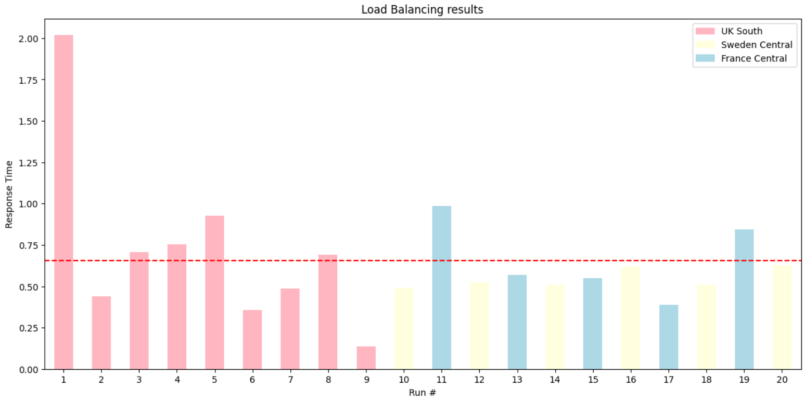

# APIM ❤️ AI Foundry

## [Backend pool Load Balancing lab](backend-pool-load-balancing.ipynb)

Playground to try the built-in load balancing [backend pool functionality of APIM](https://learn.microsoft.com/azure/api-management/backends?tabs=bicep) to a list of Azure AI Foundry endpoints.
**This is a typical prioritized PTU with fallback consumption scenario**. The lab specifically showcases how a priority 1 (highest) backend is exhausted before gracefully falling back to two equally-weighted priority 2 backends.

### Result

### Prerequisites

- [Python 3.12 or later version](https://www.python.org/) installed
- [VS Code](https://code.visualstudio.com/) installed with the [Jupyter notebook extension](https://marketplace.visualstudio.com/items?itemName=ms-toolsai.jupyter) enabled
- [uv](https://docs.astral.sh/uv/) — run `uv sync` from the repo root to install dependencies
- [An Azure Subscription](https://azure.microsoft.com/free/) with [Contributor](https://learn.microsoft.com/en-us/azure/role-based-access-control/built-in-roles/privileged#contributor) + [RBAC Administrator](https://learn.microsoft.com/en-us/azure/role-based-access-control/built-in-roles/privileged#role-based-access-control-administrator) or [Owner](https://learn.microsoft.com/en-us/azure/role-based-access-control/built-in-roles/privileged#owner) roles
- [Azure CLI](https://learn.microsoft.com/cli/azure/install-azure-cli) installed and [Signed into your Azure subscription](https://learn.microsoft.com/cli/azure/authenticate-azure-cli-interactively)

### 🚀 Get started

Proceed by opening the [Jupyter notebook](backend-pool-load-balancing.ipynb), and follow the steps provided.

### 🗑️ Clean up resources

When you're finished with the lab, you should remove all your deployed resources from Azure to avoid extra charges and keep your Azure subscription uncluttered.
Use the [clean-up-resources notebook](clean-up-resources.ipynb) for that.

---

## 📌 Deployment notes for this environment (shared APIM)

Like `finops-framework`, this lab does **not** deploy its own dedicated APIM instance in this environment — it attaches to the same pre-existing, shared APIM instance (`apim-shared-pdcibwky2f5ms`, resource group `rg-shared-apim-gateway-V2`) that hosts the other consolidated labs, creating only its own API (`backend-pool-inference-api`, path `backend-pool-inference`) inside it.

### Custom dashboard

A companion React dashboard (`dashboard-pool-balancing`, deployed to App Service in resource group `appsvc_linux_eastus_basic`) calls this API **directly from the browser** (no server-side proxy — unlike the FinOps dashboard). It's used to visualize the priority-1-then-fallback traffic split by running batches of calls and watching which backend region answers each one.

### Migration issues found and fixed

1. **CORS — missing policy, then wrong origin.** `backend-pool-inference-api`'s policy had no `<cors>` block at all initially. One was added, but the first attempt used the wrong origin: `https://dashboard-pool-balancing.azurewebsites.net` (assumed) instead of the real one, which carries the Azure-assigned App Service suffix: `https://dashboard-pool-balancing-c2d7b4degyghazcs.eastus-01.azurewebsites.net`. Corrected the `<origin>` in the policy and redeployed — since this only updates one API's policy (not the whole APIM), the change applied in seconds.
2. **401 after CORS was fixed — wrong subscription key.** Once CORS stopped blocking the request, the dashboard's calls started reaching the gateway but got rejected with `401 Access Denied`. Root cause: the "API Key" field in the dashboard's Configuración was a stale subscription key left over from before this lab was consolidated onto the shared APIM (i.e. not tied to the Product/Subscription that's actually linked to `backend-pool-inference-api` on this shared instance). Fixed by pulling the Primary key from the correct Subscription/Product on `apim-shared-pdcibwky2f5ms` instead. General lesson for this environment: after migrating a lab to the shared APIM, any client (dashboard, notebook, script) needs its subscription key re-pulled from the shared instance — a key that worked pre-consolidation will not work here even if the header name and API path are otherwise correct.

### Known open item: model capacity (5 vs 8)

The notebook's comment says the model capacity should be `8`, but the deployed code currently sets it to `5`. Per this lab's own "known issues" checklist, too low a capacity can break the *ordered* fallback the lab is meant to demonstrate (Priority 1 exhausting cleanly before spilling over to the two Priority 2 backends, rather than an early/erratic failover). This has **not** been resolved yet — decide and update both the notebook comment and the code together before relying on this lab for a clean fallback demo.

### A note on the shared APIM's SKU (Developer)

Same caveat as documented in `finops-framework`'s README: the shared instance this lab attaches to runs on the **Developer** SKU — a deliberate, cost-conscious choice for a multi-lab, low/bursty-traffic environment, but **Developer tier carries no SLA and is explicitly documented by Microsoft as not intended for production use**. For a production deployment of this backend-pool pattern, move to **Standard v2** or **Premium (v2)** (SLA, scaling, VNet integration) — or **Basic v2** if you need an SLA on a tighter budget without the higher tiers' scaling/caching features. The Bicep pattern used here (attach to an `existing` shared APIM via a module with explicit `scope`, rather than provisioning a dedicated instance per lab) is unaffected by which SKU the shared instance runs on.