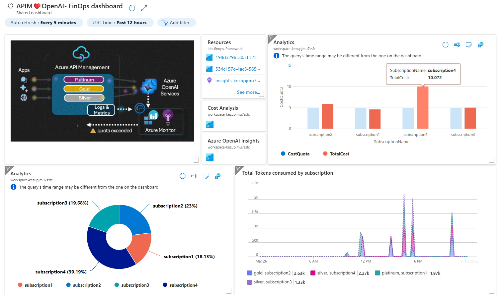

# APIM ❤️ FinOps

## [FinOps Framework lab](finops-framework.ipynb)

[](finops-framework.ipynb)

This playground leverages the [FinOps Framework](https://www.finops.org/framework/) and Azure API Management to control AI costs. It uses the [token limit](https://learn.microsoft.com/en-us/azure/api-management/azure-openai-token-limit-policy) policy for each [product](https://learn.microsoft.com/en-us/azure/api-management/api-management-howto-add-products?tabs=azure-portal&pivots=interactive) and integrates [Azure Monitor alerts](https://learn.microsoft.com/en-us/azure/azure-monitor/alerts/alerts-overview) with [Logic Apps](https://learn.microsoft.com/en-us/azure/azure-monitor/alerts/alerts-logic-apps?tabs=send-email) to automatically disable APIM [subscriptions](https://learn.microsoft.com/en-us/azure/api-management/api-management-subscriptions) that exceed cost quotas.

### Result



### Prerequisites

- [Python 3.12 or later version](https://www.python.org/) installed
- [VS Code](https://code.visualstudio.com/) installed with the [Jupyter notebook extension](https://marketplace.visualstudio.com/items?itemName=ms-toolsai.jupyter) enabled
- [uv](https://docs.astral.sh/uv/) — run `uv sync` from the repo root to install dependencies
- [An Azure Subscription](https://azure.microsoft.com/free/) with [Contributor](https://learn.microsoft.com/en-us/azure/role-based-access-control/built-in-roles/privileged#contributor) + [RBAC Administrator](https://learn.microsoft.com/en-us/azure/role-based-access-control/built-in-roles/privileged#role-based-access-control-administrator) or [Owner](https://learn.microsoft.com/en-us/azure/role-based-access-control/built-in-roles/privileged#owner) roles
- [Azure CLI](https://learn.microsoft.com/cli/azure/install-azure-cli) installed and [Signed into your Azure subscription](https://learn.microsoft.com/cli/azure/authenticate-azure-cli-interactively)

### 🚀 Get started

Proceed by opening the [Jupyter notebook](finops-framework.ipynb), and follow the steps provided.

### 🗑️ Clean up resources

When you're finished with the lab, you should remove all your deployed resources from Azure to avoid extra charges and keep your Azure subscription uncluttered.
Use the [clean-up-resources notebook](clean-up-resources.ipynb) for that.

---

## 📌 Deployment notes for this environment (shared APIM)

This lab does **not** deploy its own dedicated APIM instance in this environment. It has been adapted to attach to a pre-existing, shared APIM instance (`apim-shared-pdcibwky2f5ms`, resource group `rg-shared-apim-gateway-V2`) that also hosts other labs (e.g. `backend-pool-load-balancing`), so this lab creates only its own API, Products and subscriptions inside that shared instance instead of provisioning a new APIM.

### Migration steps performed

1. **Repointed the shared-APIM target.** `finopsframework.ipynb` (Cell 2️⃣) and `main.bicep` originally hardcoded a *different*, older shared APIM (`apim-shared-uzpevdi2gs3nc` / `rg-shared-apim-gateway`, no `-V2` suffix) — leftover from a deployment that predates this environment's current shared instance. Updated `shared_apim_name` / `shared_apim_resource_group_name` (notebook) and the matching `sharedApimName` / `sharedApimResourceGroupName` bicep param defaults to point at the current instance above.
2. **Namespaced Products and subscriptions** to avoid cross-lab collisions. `apim_products_config` / `apim_subscriptions_config` used generic tier names (`platinum` / `gold` / `silver`). On a shared APIM, `Microsoft.ApiManagement/service/products/apiLinks` resource names are derived only from the Product name (`openai-${product.name}`), not from the API being linked — so two labs both using a generic `platinum` Product would silently overwrite each other's API link on redeploy (no ARM error, just one lab's traffic getting unlinked). Renamed to `finops-framework-platinum` / `-gold` / `-silver` so this lab can never collide with another lab's Products, regardless of what naming convention the other lab uses. `inferenceAPIName` (`finops-framework-inference-api`) and `inferenceAPIPath` (`finops-framework-inference`) were already lab-scoped and did not need changes — see the warning already left in `main.bicep` about API name collisions being the root cause of a prior outage.
3. **Granted the shared APIM's managed identity access to the shared AI Foundry backend.** The API's backend (`agents-foundry-tazvvonn4lhea`, from a separate `ai-foundry-model-gateway` lab's resource group — pre-existing models, not deployed by this lab) is called via the calling APIM instance's managed identity, not an API key. The *old* shared APIM's identity already had this grant; the current instance's identity does not carry it over automatically (it's a different Azure resource, different principal). Required role assignment:
   ```bash
   az role assignment create \
     --assignee <shared-APIM-managed-identity-principal-id> \
     --role "Cognitive Services OpenAI User" \
     --scope <resourceId of agents-foundry-tazvvonn4lhea>
   ```
   Symptom if missing: `PermissionDenied` / `lacks the required data action Microsoft.CognitiveServices/accounts/OpenAI/deployments/chat/completions/action` — this is an RBAC error from the Foundry account itself, surfacing as HTTP 401 through the SDK; it means the request already passed APIM (CORS, subscription key, product token-limit) successfully.
4. **Companion dashboard (`finops-dashboard`, deployed to its own App Service).** FastAPI backend + static frontend served from the same App Service (no CORS to manage), backend queries the lab's own Log Analytics workspace via the App Service's managed identity (needs **"Log Analytics Reader"** on that workspace — `deploy.sh` handles this automatically) and proxies test chat calls to the shared APIM server-side, so subscription keys are never sent to the browser. Two deploy-time bugs found and fixed before first deploy:
   - `INFERENCE_API_PATH` was set to the generic `"inference"` in `deploy.sh`/`README.md` instead of `"finops-framework-inference"` — the exact collision risk this lab's own code already warns against.
   - `requirements.txt` lives at the repo root (sibling to `backend/`/`frontend/`), but `deploy.sh`'s `zip` command only packaged `backend` and `frontend`, silently excluding it from the deploy and breaking the Oryx build (no dependencies installed → app fails to start).

### A note on the shared APIM's SKU (Developer)

The shared instance this lab (and its siblings) attach to runs on the **Developer** SKU. That's a deliberate, cost-conscious choice for this kind of environment (multiple labs, low/bursty traffic, no need for guaranteed throughput) — but **Developer tier carries no SLA and is explicitly documented by Microsoft as not intended for production use** (single scale unit, no availability-zone support, no built-in redundancy).

For a production deployment, plan to move this same "shared APIM, per-lab API" pattern onto a production-grade SKU instead — typically **Standard v2** or **Premium (v2)** for SLA, scaling, and VNet integration, or **Basic v2** as a lower-cost option if you still need an SLA but not the higher tiers' scaling/caching features. The migration approach documented above (attach existing APIs/Products to an `existing` APIM resource via Bicep, rather than each lab provisioning its own instance) carries over unchanged to any of those SKUs — only the APIM instance's own SKU/tier changes, not how each lab's `main.bicep` references it.